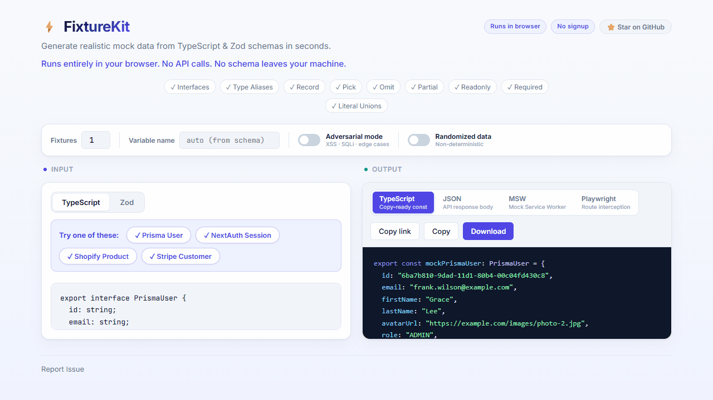

# FixtureKit

**Generate fixtures, mocks, and test data from TypeScript and Zod schemas.**



**Live:** https://fixture-kit.vercel.app · **GitHub:** https://github.com/Wasef-Hussain/FixtureKit

FixtureKit is a browser-based tool that generates realistic mock data from your type definitions — no libraries, no setup, no backend. Everything runs in your browser.

## What it does

1. Paste a TypeScript `interface` or `type`, or a Zod `z.object(...)` schema (including `const Schema = ...` declarations)
2. Choose how many fixtures you want (1–1000)
3. Pick an output format: **TypeScript**, **JSON**, **MSW**, or **Playwright**
4. Copy or download — drop straight into tests, mocks, or API stubs

Field names drive semantic inference: `email` gets a realistic email, `createdAt` gets an ISO date, `price` gets a plausible number. Output is deterministic by default — the same schema always produces the same fixtures (unless you enable Randomized mode).

### V2.1 — Multi-format output

| Format | Use for |
|--------|---------|
| **TypeScript** | `export const mockUser: User = { ... }` in test files |
| **JSON** | API response bodies, seed data, Postman |
| **MSW** | Mock Service Worker v2 handler (`http.get` + `HttpResponse.json`) |
| **Playwright** | `page.route` + `route.fulfill` snippet for E2E tests |

### V2.1 — Adversarial mode

Toggle **Adversarial mode** to inject stress-test values:

- XSS payloads (`<script>…`, `">`)
- SQLi strings (`' OR 1=1--`)
- Boundary values (5000-char strings, `0`, `-1`, `Number.MAX_SAFE_INTEGER`)
- Random `null` / `undefined` on optional fields

Useful for verifying sanitization, validation, and null-handling in your app.

### Randomized data

Toggle **Randomized data** to break determinism:

- Generates completely random data for every fixture on every run.
- Use the **🔀 Shuffle** button to reroll new data on demand.
- Perfect for generating large datasets (up to 1000 records) to populate complex UI mocks and tables.

### Shareable URLs
Click **Copy link** in the output toolbar to copy a URL that encodes your schema, mode, fixture count, and output format. Anyone who opens the link gets the schema pre-loaded instantly — no backend, no storage, encoded in the URL hash.

## Example

**Input:**

```ts
interface User {
  id: string
  name: string
  email: string
  createdAt: Date
  isActive: boolean
}
```

**TypeScript output:**

```ts
export const mockUser: User = {
  id: "f47ac10b-58cc-4372-a567-0e02b2c3d479",
  name: "Alice Johnson",
  email: "alice.johnson@example.com",
  createdAt: "2024-03-15T10:30:00.000Z",
  isActive: true,
}
```

**JSON output:**

```json
{
  "id": "f47ac10b-58cc-4372-a567-0e02b2c3d479",
  "name": "Alice Johnson",
  "email": "alice.johnson@example.com",
  "createdAt": "2024-03-15T10:30:00.000Z",
  "isActive": true
}
```

**MSW output:**

```ts
import { http, HttpResponse } from 'msw'

export const mockUserHandler = http.get('/api/endpoint', () => {
  return HttpResponse.json({ /* generated data */ })
})
```

## Supported input

**TypeScript:** `interface`, `type` aliases, primitives, arrays, nested objects, optional properties, unions, string/number/boolean literals

**Zod:** `const Schema = z.object(...)`, `export const Schema = z.object(...)`, `z.string`, `z.number`, `z.boolean`, `z.date`, `z.array`, `z.enum`, `z.union`, `z.literal`, `.optional()`, `.nullable()`

Supports `Record<K, V>`, `Partial<T>`, `Pick<T>`, `Omit<T>`, `Readonly<T>`, `Required<T>`. Generics, mapped types, conditional types, `.refine`, `.transform`, and other advanced features are out of scope and will gracefully return a clear error message.

## Testing

See **[docs/TESTING.md](docs/TESTING.md)** for manual use cases (UC-01 through UC-10) covering all output tabs and adversarial mode.

```bash
npm run verify:v21   # V2.1 logic smoke test (15 assertions)
npm run verify       # all parser + generator checks
```

## Tech

React 18 · TypeScript 5 · Vite · TypeScript compiler API (in-browser, no `eval`) · No backend

## Run locally

```bash
npm install
npm run dev
```

Build:

```bash
npm run build
```

## License

MIT
